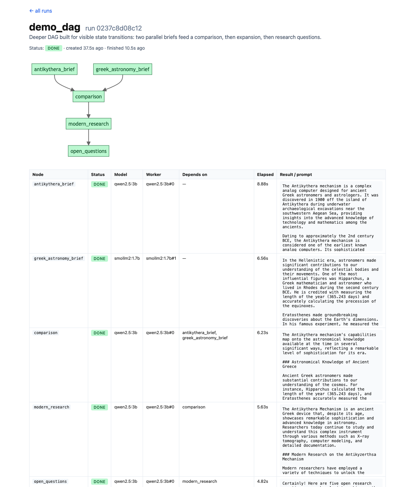

# SLM Queue Server

A local prototype of a task queue + worker pool for small language models.
Tasks (natural-language prompts) are submitted over HTTP, routed to a model
by simple heuristics, dispatched to a pool of worker threads, and answered
by a shared local [Ollama](https://ollama.com/) backend.

The worker pool topology is read directly from
[`../slm-deploy/slms.yaml`](../slm-deploy/slms.yaml) — the same spec that
[`slm-deploy/validate.py`](../slm-deploy/validate.py) checks for node fit.

## Architecture

```
                                         per-model queue.Queue
                                       ┌───────────────────────┐
                                       │ smollm2:1.7b  ──► W#0 │
   client ──► POST /tasks ──► router ──┤              ──► W#1 │
                                       │ gemma2:2b     ──► W#0 │──► ollama serve
                                       │ llama3.2:3b   ──► W#0 │     (one process,
                                       │ qwen2.5:3b    ──► W#0 │      one weight copy
                                       └───────────────────────┘      per model)
                                                 │
   client ──► GET /tasks/<id> ◄── in-memory results table ◄────────────┘
```

- **One queue per declared model** (`queue.Queue`, thread-safe).
- **One worker thread per replica** (`spec.replicas` in the YAML).
- **Single Ollama backend** — each unique model is loaded into memory once.
  Replicas are concurrent client workers, not duplicated weight copies.
  Set `OLLAMA_NUM_PARALLEL=N` when starting `ollama serve` if you want real
  parallel generation against the same model.

## Files

| File                  | Purpose                                                          |
| --------------------- | ---------------------------------------------------------------- |
| `server.py`           | HTTP server, dispatcher, per-model queues, worker threads.       |
| `router.py`           | `choose_model(prompt, available)` — rule-based routing.          |
| `planner.py`          | DAG plan model + `PlanRunner` that drives a plan to completion.  |
| `ui.py`               | HTML rendering (Mermaid diagram + status table) for plan runs.   |
| `client.py`           | Demo client; submits a batch and polls until done.               |
| `mcp_server.py`       | MCP server exposing `slm_submit_plan` / `slm_wait_plan` tools.   |
| `plans/*.json`        | Hand-authored example DAG plans (see "Producer side" below).     |
| `requirements.txt`    | Only the MCP server has a pip dep (`mcp[cli]`); core is stdlib.  |

## Endpoints

| Method | Path                          | Purpose                                                                |
| ------ | ----------------------------- | ---------------------------------------------------------------------- |
| POST   | `/tasks`                      | `{"prompt": "..."}` → `202 {"task_id", "model"}`                       |
| GET    | `/tasks/<id>`                 | task state: `status`, `model`, `worker`, `result`, timestamps          |
| GET    | `/status`                     | queue depths, task counters, worker count                              |
| POST   | `/plans`                      | `{"plan_file": "..."}` or `{"plan": {...}}` → `202 {"run_id"}`        |
| GET    | `/plans`                      | list of runs + plan files in `plans/`                                  |
| GET    | `/plans/<run_id>`             | full plan run state as JSON                                            |
| GET    | `/plans/<run_id>/ui`          | HTML status page (Mermaid graph + table, auto-refresh)                |
| GET    | `/plans/from-file/<name>`     | convenience: submit a plan file via browser, redirects to its UI       |
| GET    | `/ui`                         | landing page listing all plan files and runs                           |

Task `status` transitions: `pending` → `running` → `done` (or `error`).
Plan-node `status` transitions: `pending` → `queued` → `running` → `done`
(or `error`).

## Routing

`router.choose_model` picks among the available deployed models in this
order:

| Trigger                                                       | Model      |
| ------------------------------------------------------------- | ---------- |
| Code-ish: `code`, `function`, `python`, `sql`, `regex`, ` ``` ` | `qwen2.5`  |
| Math/reasoning: `calculate`, `solve`, `prove`, `equation`, …  | `llama3.2` |
| Long prompt (`len(prompt) > 500`)                             | `gemma2`   |
| Default (fastest)                                             | `smollm2`  |

If a preferred model isn't deployed, the next rule wins; ultimate fallback
is the first deployed model.

## Run

```sh
# Terminal 1 — start ollama (set NUM_PARALLEL for replica parallelism)
OLLAMA_NUM_PARALLEL=2 ollama serve

# Terminal 2 — start the queue server
python3 slm-queue/server.py --port 8080

# Terminal 3 — submit a batch
python3 slm-queue/client.py --base http://127.0.0.1:8080
```

Or hit it directly with `curl`:

```sh
curl -s -X POST http://127.0.0.1:8080/tasks \
  -H 'Content-Type: application/json' \
  -d '{"prompt": "Write a Python function for the nth Fibonacci number."}'
# {"task_id": "bdc279732301", "model": "qwen2.5:3b"}

curl -s http://127.0.0.1:8080/tasks/bdc279732301
curl -s http://127.0.0.1:8080/status
```

## Experiment

10 prompts submitted as a batch against the default deployment
(`smollm2:1.7b`×2, `gemma2:2b`×1, `llama3.2:3b`×1, `qwen2.5:3b`×1 — 5
workers total). Ollama at default settings (single-stream per model).

### Routing — which model received each prompt

| Prompt (truncated)                                   | Routed to      | Why          |
| ---------------------------------------------------- | -------------- | ------------ |
| Write a Python function for nth Fibonacci…           | `qwen2.5:3b`   | code         |
| Write a regex that matches a US zip code.            | `qwen2.5:3b`   | code         |
| Give me a SQL query to find the top 3 customers…    | `qwen2.5:3b`   | code         |
| Calculate 17 * 23 and show your reasoning…          | `llama3.2:3b`  | math         |
| Solve for x: 3x + 5 = 26.                            | `llama3.2:3b`  | math         |
| Prove that the sum of two even integers is even.    | `llama3.2:3b`  | math         |
| Summarize photosynthesis in one sentence.           | `smollm2:1.7b` | default      |
| Name three jazz musicians active in the 1950s.      | `smollm2:1.7b` | default      |
| What is the capital of Iceland?                     | `smollm2:1.7b` | default      |
| (700-char story prompt about a lighthouse keeper)   | `gemma2:2b`    | long prompt  |

### Timing — per task

`queue` is the wait between submission and a worker picking it up;
`gen` is the actual Ollama call.

| task_id        | worker             | queue (s) | gen (s) | tokens |
| -------------- | ------------------ | --------: | ------: | -----: |
| bdc279732301   | `qwen2.5:3b#0`     |      0.00 |    8.34 |    256 |
| 6471576ca299   | `qwen2.5:3b#0`     |      8.34 |   12.07 |    256 |
| 1f541038096a   | `qwen2.5:3b#0`     |     20.42 |    6.17 |    256 |
| e4e3818440be   | `llama3.2:3b#0`    |      0.00 |    5.00 |    106 |
| ce7da52b8a4b   | `llama3.2:3b#0`    |      5.00 |   13.32 |     83 |
| e1442a34f715   | `llama3.2:3b#0`    |     18.32 |    4.09 |    130 |
| 5f42c35d9ede   | `smollm2:1.7b#1`   |      0.00 |    2.62 |     42 |
| bf4d6791ddc6   | `smollm2:1.7b#0`   |      0.00 |    5.79 |    142 |
| 109716e87c86   | `smollm2:1.7b#1`   |      2.62 |    6.32 |     25 |
| 9df717c37630   | `gemma2:2b#0`      |      0.00 |   13.44 |    256 |

### Aggregate

| Model           | tasks | total gen | avg gen |
| --------------- | ----: | --------: | ------: |
| `qwen2.5:3b`    |     3 |    26.59s |   8.86s |
| `llama3.2:3b`   |     3 |    22.42s |   7.47s |
| `smollm2:1.7b`  |     3 |    14.73s |   4.91s |
| `gemma2:2b`     |     1 |    13.44s |  13.44s |

**Wall time end-to-end: 26.89s** — vs ~77s if everything had been serialized
on one worker. The speedup is bounded by the slowest *per-model* queue
(qwen2.5 with three code prompts).

### Observations

- **Replicas worked.** Two smollm2 tasks were picked up immediately by
  workers `#0` and `#1` in parallel (both at `queue=0.00s`); the third
  smollm2 task only waited 2.62s, getting `#1` as soon as it freed up.
- **Single-replica models serialized.** qwen2.5 received 3 prompts; tasks
  2 and 3 waited ~8s and ~20s respectively in the queue.
- **Routing held.** Every prompt landed on the model the heuristics
  predicted. Long-prompt routing only triggered above 500 chars (an
  earlier 367-char "long story" prompt fell through to smollm2; padding
  to 700 chars correctly routed to gemma2).
- **Ollama serialization caveat.** With default `OLLAMA_NUM_PARALLEL=1`,
  two smollm2 worker threads still hit a serialized backend even though
  they pulled from the queue independently. To see *generation*
  parallelism (not just dispatch parallelism), restart ollama with
  `OLLAMA_NUM_PARALLEL` >= the maximum `replicas` in `slms.yaml`.

## Producer side: DAG plans

The endpoints above let an outside system (think: Claude Code generating a
plan from a high-level prompt) submit a *plan* — a directed acyclic graph
of small prompt nodes — and watch it execute as upstream results feed
downstream nodes. The plan is the snapshot of what's to be done; the
runner walks the topology and submits each ready node to the same queue
described above.

### Plan schema

A plan is a JSON document with a list of nodes. Each node declares its
upstream dependencies, and its prompt may reference any direct
upstream's output via `{{node_id.result}}`.

```json
{
  "plan_id": "research_iceland",
  "description": "Diamond DAG: two parallel research strands, fused, then questions.",
  "nodes": [
    {"id": "economy",   "prompt": "List 5 facts about Iceland's economy.",  "depends_on": []},
    {"id": "history",   "prompt": "List 5 facts about Iceland's history.",  "depends_on": []},
    {"id": "summary",   "prompt": "Combine into a paragraph:\nEconomy:\n{{economy.result}}\nHistory:\n{{history.result}}",
                                                                            "depends_on": ["economy", "history"]},
    {"id": "questions", "prompt": "Generate 3 follow-up questions:\n{{summary.result}}",
                                                                            "depends_on": ["summary"]}
  ]
}
```

The loader validates that:
- node ids are unique,
- every `depends_on` entry references a real node,
- every `{{X.result}}` placeholder corresponds to a declared direct dep,
- the graph has no cycles (Kahn topo sort).

### Execution

Each plan run gets its own background `PlanRunner` thread. On every tick
it:

1. Finds nodes whose `depends_on` are all `done` and submits each to the
   `Dispatcher` (so the router still picks the model per-node, on the
   *resolved* prompt).
2. Mirrors the dispatcher's task state into the plan-node state.
3. Terminates when all nodes are `done` (run = `done`) or no node can
   make further progress (run = `error`).

The resolved prompt (with parents' outputs substituted in) is what the
router sees, so downstream nodes often end up routed differently from
their template — e.g. a templated summary node typically grows past the
500-char threshold and routes to `gemma2`.

### HTML status page

`GET /plans/<run_id>/ui` returns a self-contained HTML page with a
Mermaid `graph TD` diagram (nodes colored by status) and a table of
nodes (status, assigned model, worker, elapsed time, result or resolved
prompt). The page auto-refreshes every 2s while the run is `running`
and stops refreshing once it's `done` or `error`.

`GET /ui` is a landing page listing both the plan files on disk and all
runs that have happened in this server's lifetime.



The screenshot above is the live view of a 5-node DAG run
(`antikythera_brief || greek_astronomy_brief → comparison →
modern_research → open_questions`) just after it completed. Mermaid
renders the topology with each node tinted by status (green = `done`).
The table below lists per-node model assignment, worker label, elapsed
time, and a snippet of either the resolved prompt or the result.

### Submitting

```sh
# from JSON via POST
curl -s -X POST http://127.0.0.1:8080/plans \
  -H 'Content-Type: application/json' \
  -d '{"plan_file": "research_iceland.json"}'
# {"run_id": "a5be245ff3ce", "plan_id": "research_iceland"}

# or just open the browser at http://127.0.0.1:8080/ui and click a plan file
```

### Experiment — both example plans

Both bundled plans run cleanly against the default 5-worker pool.
Numbers below are from one local run (`OLLAMA_NUM_PARALLEL=1`, default).

**`research_iceland`** — diamond: `economy || history → summary → questions`.
Wall: **13.36s**.

| Node       | Model         | Worker            | Queue (s) | Gen (s) | Tokens |
| ---------- | ------------- | ----------------- | --------: | ------: | -----: |
| economy    | `smollm2:1.7b` | `smollm2:1.7b#0` |      0.00 |    4.32 |    160 |
| history    | `smollm2:1.7b` | `smollm2:1.7b#1` |      0.00 |    4.07 |    136 |
| summary    | `gemma2:2b`    | `gemma2:2b#0`    |      0.00 |    4.64 |    139 |
| questions  | `gemma2:2b`    | `gemma2:2b#0`    |      0.00 |    3.26 |    175 |

**`poem_writing`** — funnel: `theme → (imagery || emotions) → poem`. Wall:
**7.28s**.

| Node      | Model         | Worker            | Queue (s) | Gen (s) | Tokens |
| --------- | ------------- | ----------------- | --------: | ------: | -----: |
| theme     | `smollm2:1.7b` | `smollm2:1.7b#1` |      0.00 |    0.38 |      4 |
| imagery   | `smollm2:1.7b` | `smollm2:1.7b#0` |      0.00 |    1.92 |    115 |
| emotions  | `smollm2:1.7b` | `smollm2:1.7b#1` |      0.00 |    0.65 |     33 |
| poem      | `gemma2:2b`    | `gemma2:2b#0`    |      0.00 |    3.84 |    192 |

Observations:

- **Parallelism along the cut.** Independent siblings (`economy ||
  history`, `imagery || emotions`) were picked up by the two smollm2
  replicas in the same tick — both saw queue wait = 0.00s.
- **Routing adapts to the resolved prompt.** Downstream nodes templated
  in their parents' outputs, pushing the resolved prompt past the
  router's 500-char threshold, so `summary`, `questions`, and `poem`
  all routed to `gemma2`.
- **The producer side is decoupled from the consumer side.** Plans only
  speak in prompts and dependencies; everything model-selection /
  routing / replica-dispatch happens downstream in the existing queue.

## Delegating from Claude Code via MCP

`mcp_server.py` exposes the queue as two tools over the
[Model Context Protocol](https://modelcontextprotocol.io/), so a Claude
Code session can decompose a user prompt into a small DAG, hand the
whole plan to local SLM workers, and compose the final answer itself —
instead of doing every leaf step with the frontier model.

### Tool surface

| Tool              | Inputs                  | Returns                                            |
| ----------------- | ----------------------- | -------------------------------------------------- |
| `slm_submit_plan` | `plan: dict`            | `{"run_id", "plan_id"}` — DAG starts in background |
| `slm_wait_plan`   | `run_id`, `timeout_s?`  | full plan snapshot when run hits a terminal state  |

Both tools speak to the queue's existing HTTP endpoints; the MCP server
is a thin protocol adapter.

### Setup

```sh
# Once
python3 -m venv .venv
.venv/bin/pip install -r slm-queue/requirements.txt    # mcp[cli]

# Each session: start both processes
.venv/bin/python slm-queue/server.py --port 8080     &  # queue + workers
.venv/bin/python slm-queue/mcp_server.py --port 8090 &  # MCP adapter
```

`mcp_server.py` must be launched with `.venv/bin/python` — the `mcp[cli]`
dependency only lives in the venv. Using `python3` (system Homebrew) will
fail with `ModuleNotFoundError: No module named 'mcp'`. `server.py` is
stdlib-only so either interpreter works, but using `.venv/bin/python` for
both keeps the invocation consistent.

If a previous session left either port bound (`OSError: [Errno 48]
Address already in use`), find and stop the stale process before
restarting:

```sh
lsof -i :8080 -i :8090        # shows PIDs holding the ports
kill <pid> <pid>
```

Add to `.mcp.json` (project root or `~/.claude/mcp.json`):

```json
{
  "mcpServers": {
    "slm-queue": {
      "type": "http",
      "url": "http://127.0.0.1:8090/mcp"
    }
  }
}
```

Restart Claude Code; `slm_submit_plan` and `slm_wait_plan` show up in
the tool list.

### Delegation pattern

When Claude Code gets a user prompt that benefits from fan-out (e.g.
parallel research, drafting boilerplate, summarizing many items), it
should:

1. **Decompose** the prompt into a DAG — usually a handful of
   independent leaf nodes that produce raw material, then one or two
   downstream nodes that fuse them.
2. **Call `slm_submit_plan`** with the JSON plan, receive a `run_id`.
3. **Call `slm_wait_plan`** to block until all nodes finish.
4. **Compose** the final answer from the returned `nodes[id].result`
   strings. Claude stays responsible for synthesis and quality; the
   SLMs only do the cheap mechanical leg-work.

What stays with the frontier model: planning the DAG, judging output
quality, the final synthesis. What moves to local SLMs: the per-node
generation work.

### E2E smoke test

```sh
# With both servers running:
.venv/bin/python -c "
import json, urllib.request
# (init + tools/call elided — see slm-queue/mcp_server.py docstring)
"
```

The plan below was submitted and waited via the MCP tools and finished
in **3.94s** wall:

```
facts_es ─┐
          ├─► compare
facts_jp ─┘
```

| Node      | Status | Model         | Worker            |
| --------- | ------ | ------------- | ----------------- |
| facts_es  | done   | smollm2:1.7b  | smollm2:1.7b#1    |
| facts_jp  | done   | smollm2:1.7b  | smollm2:1.7b#0    |
| compare   | done   | qwen2.5:3b    | qwen2.5:3b#0      |

(The compare node routed to qwen2.5 rather than gemma2 because the
substituted Japan facts contained the substring "code" in "code of
conduct" — an artefact of the router's simple substring matching.)

## Limitations

This is a prototype, not a production queue. Not implemented: persistence
(restart loses queue + results), backpressure / max queue depth, retries,
auth, streaming responses, distributed workers, cancellation,
result-eviction (results & plan runs tables grow unbounded).
